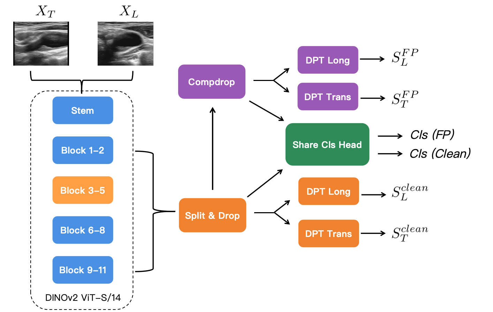

# [CSV]-Deeper-rank2


## 🤝 Collaborating Institutions

- **Beijing University of Technology** (BJUT), China
- **Department of Neurology, Rizhao Hospital of Traditional Chinese Medicine**, China
- **School of Biomedical Engineering, Dalian University of Technology**, China

### 1.Overview
We propose DINOv2-Enhanced Dual-View UniMatch, a novel framework for joint carotid plaque segmentation and classification. Central to our approach is the utilization of the powerful DINOv2 foundation model as a shared backbone to extract robust, view-invariant features from complementary longitudinal and transverse scans, processed via independent DPT decoders. We introduce a two-stage training strategy integrated with the UniMatch protocol achieving a Seg-score of 62.59 and an F1-Score of 72.09 on the unseen test set 



### 2. Train

```bash

python split_train_valid_fold.py --root ./data --seed 2026 --val_size 25


python train_stage1.py \
  --train-labeled-json ./data/train_labeled.json \
  --train-unlabeled-json ./data/train_unlabeled.json \
  --valid-labeled-json ./data/valid.json \
  --model dpt \
  --save_path ./checkpoints \
  --gpu 0 \
  --train_epochs 50 \
  --resize_target 448 \
  --batch_size 1
  
python train_stage2.py \
  --train-labeled-json ./data/train_labeled.json \
  --train-unlabeled-json ./data/train_unlabeled.json \
  --valid-labeled-json ./data/valid.json \
  --model dpt \
  --save_path ./checkpoints_1 \
  --gpu 0 \
  --train_epochs 50 \
  --resize_target 448 \
  --batch_size 1
```


### 3. Performance Metrics on CSV 2026 Challenge Validation and Test Sets

| Backbone | Validation Seg-score | Validation F1 | Test Seg-score | Test F1 |
|:---------|:--------------------:|:-------------:|:--------------:|:-------:|
| DINOv2-S | 66.46 | 50.67 | 62.59 | 72.09 |
| DINOv2-B | 66.02 | 63.77 | 62.0 | 69.2 |


### 4. Acknowledgements

This project benefits significantly from the open-source implementation of the **CSV 2026: Carotid Plaque Segmentation and Vulnerability Assessment in Ultrasound** and ShanghaiTech University for facilitating the data use agreement for this competition.

- **Challenge**: ISBI CSV 2026: Carotid Plaque Segmentation and Vulnerability Assessment in Ultrasound
- **Repository**: [github.com/dndins/CSV-2026-Baseline](https://github.com/dndins/CSV-2026-Baseline)

We thank the team for their contribution to the medical imaging community.

